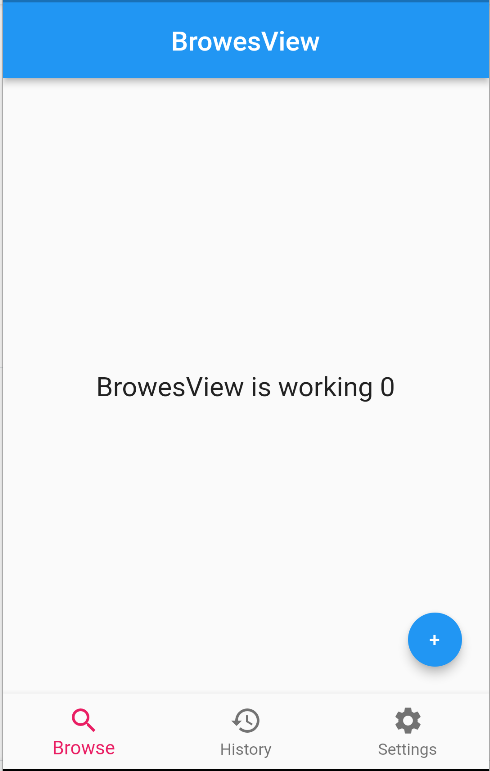

# bottom_navigation_bar_getx

A new Flutter project.

## Getting Started

This project is a starting point for a Flutter application.
***
#Getx state management use this bottom navigation bar every tab chage then load newly and every time call create and delete method on own controller
***

